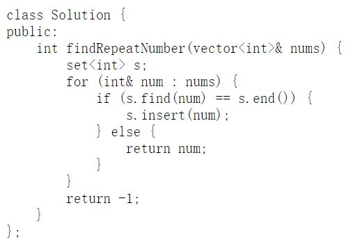
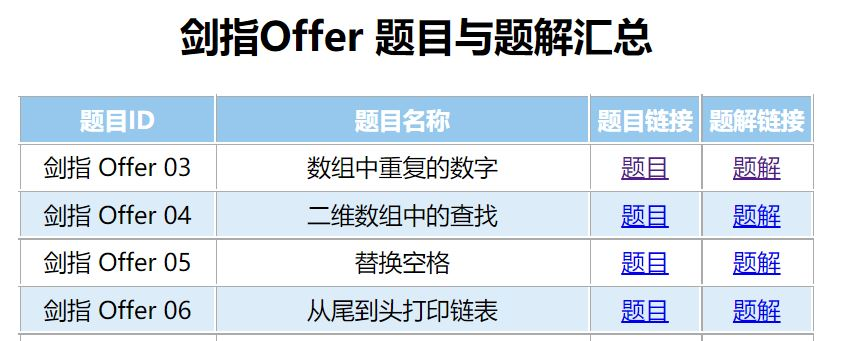

# LeetCode CN Crawler  --  LeetCode 中国站题目与题解抓取

- - - - - - -  

### 项目信息

- 名称: LeetCode CN Crawler
- 作者: Shallwe
- 日期: 2021/06/23
- 当前版本: v1.0.3
- 说明: 由于工程适用于中国站，文档使用中文。

- - - - - - -  

### 项目简介

本项目可以将 **自己账号** 在 [LeetCode中国站](https://leetcode-cn.com/) 提交过的一个最新通过的 **题解** 和对应的 **题目** 抓取下来，并整理到一个文件夹下，并自动导出了题库汇总表格。

一键抓取，自动整理，保存本地。再也不用怕备份麻烦、服务器出问题、找不到代码。Nice~

抓取后得到的文件目录举例如下。

```sh
problems
├─ lcof  # book
│  ├─ 剑指 Offer 03 - 数组中重复的数字
│  │  ├─ 数组中重复的数字.html  # problem
│  │  └─ 数组中重复的数字.cpp   # solution
│  ├─ 剑指 Offer 04 - 二维数组中的查找
│  │  ├─ 二维数组中的查找.html  # problem
│  │  └─ 二维数组中的查找.cpp   # solution
│  └─ 题目与题解汇总.html  # summary
└─ algorithms  # book
   ├─ 1 - 两数之和
   │  ├─ 两数之和.html  # problem
   │  └─ 两数之和.cpp   # solution
   └─ 题目与题解汇总.html  # summary
```

题目文件示例。


代码文件示例。



汇总文件示例。



- - - - - - -  

### 运行方法

下载本项目。在终端可直接运行，运行时会要求输入账号密码以登录。

```sh
# terminal
git clone https://github.com/shallwe999/LeetCode-CN-Crawler.git
cd LeetCode-CN-Crawler/
python main.py
```

如需更多功能，可如下运行。

```sh
python main.py -h       # 查看参数说明

python main.py -f       # force模式，强制覆盖已经抓取的题目和题解

python main.py -b BOOK  # 下载指定的题库BOOK
                        # BOOK 可选参数:
                        # all         -- 所有题库（默认）
                        # algorithms  -- 算法
                        # database    -- 数据库
                        # shell       -- Shell
                        # concurrency -- 多线程
                        # lcci        -- 程序员面试金典
                        # lcof        -- 剑指Offer

python main.py -d       # debug模式，会输出和请求更多信息用于调试

```

运行完成后，抓取的文件会放在工程目录的 `problems/` 文件夹下。

- - - - - - -  

### 更多

如果喜欢本项目，欢迎给个 **star**:star2:! :)

如果有改进意见，欢迎在 `Issue` 提出。

项目修订记录见 [changelog](./doc/changelog.md)。

本项目采用 [MIT License](./LICENSE) 开源协议。

- - - - - - -  

### TODO

- 题目添加标签。
- 题目页面美化改进。
- 题目里的图片仍为从服务器下载显示，需要改为本地。
- 题库统计页面改进。
- 指定抓取语言。
- 支持抓取多份提交。
- 支持手机验证码登录。

- - - - - - -  

### 致谢

感谢JiayangWu的[LeetCodeCN-Submissions-Crawler](https://github.com/JiayangWu/LeetCodeCN-Submissions-Crawler)项目，为本项目提供基本思路，在此基础上重新设计。
